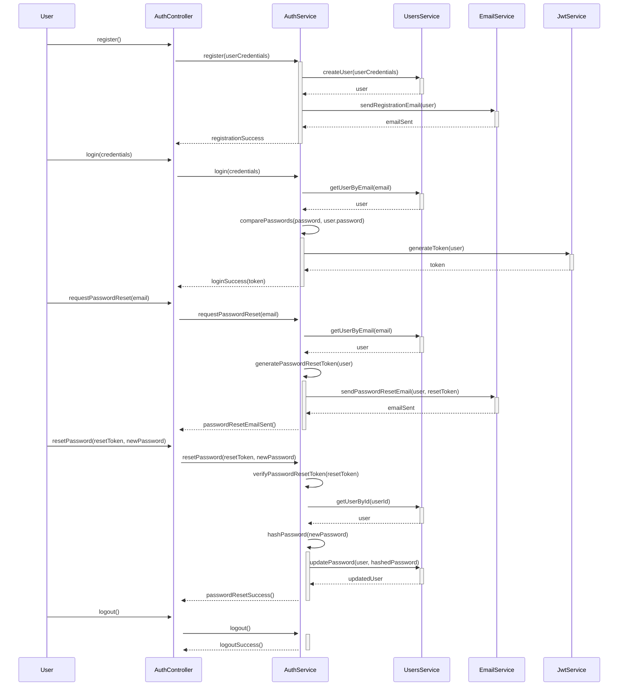
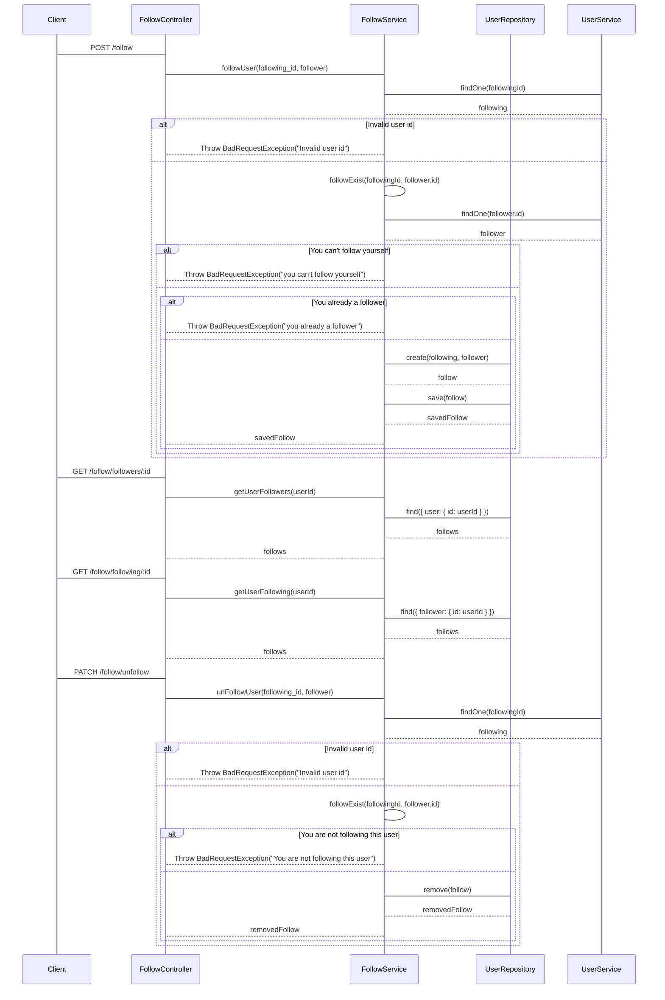
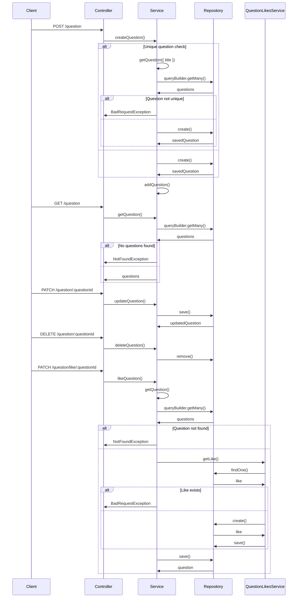
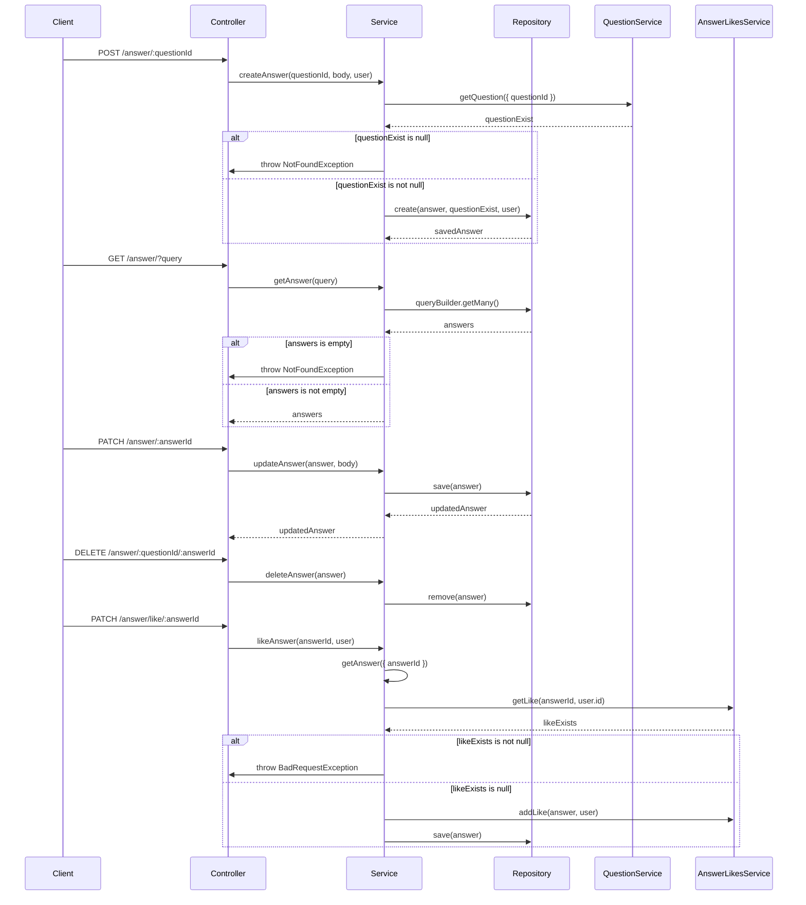
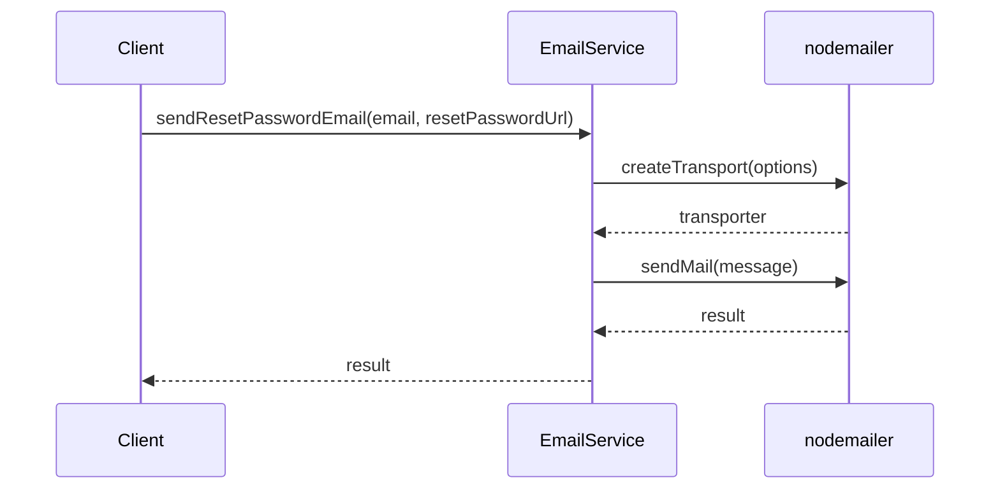
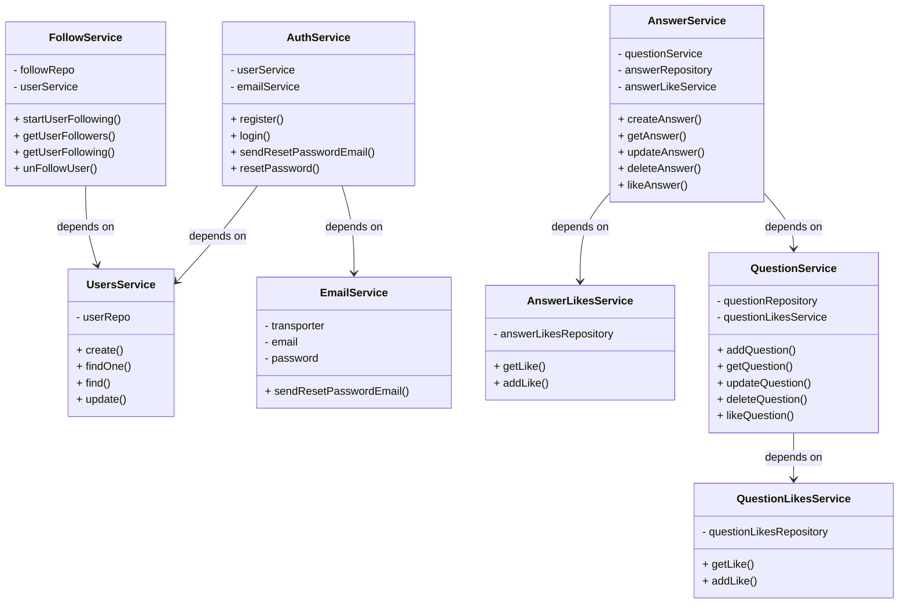

<a name="readme-top"></a>


<br>
<br>

---
### 📑 Table of Contents
- [📘 Introduction](#introduction)
- [🚀 Getting Started](#getting-started)
  - [Prerequisites ❗](#prerequisites)
  - [Environment Variables :key:](#environment-variables)
  - [Setup ⬇️](#setup)
  - [Install :heavy_check_mark: ](#install)
  - [Usage 🤿 🏃‍♂️](#usage)
- [🔍 APIs Reference](#api-reference)
- [🏗️🔨 Database ERD](#erd)
- [🔄 Sequence Diagrams](#sequence-diagram)
- [📐 UML Diagram](#uml-diagram)
- [👥 Author](#author)
- [🤝 Contributing](#contribution)
- [⭐️ Show Your Support](#support)
- [🔭 Up Next](#up-next)
- [💎 Lessons Learned](#lessons-learned)
- [📜 License ](#license)

## 📘 Introduction <a name="introduction"></a>
<p align="center">
Welcome to the How Backend project! Built with NestJS, a progressive Node.js framework, How is a robust and efficient Q&A application designed to empower users with knowledge and facilitate seamless communication. The How provides a SOLID foundation for building a feature-rich Q&A platform, where users can share knowledge, engage in discussions, and expand their understanding. This project consists of five modules, each serving a specific purpose to deliver a comprehensive user experience.
</p>

<p align="center">
The authentication module provides secure user registration, login, and password reset functionality. With guards ensuring authentication and convenient decorators like @currentUser, accessing user information is a breeze. The email module integrates Nodemailer for reliable email communication, allowing users to stay connected effortlessly. The follow module enables users to connect with others, fostering a vibrant community. The question module empowers users to create, update, and delete questions, while the answer module facilitates answering and managing questions effectively. With a focus on data management, TypeORM is utilized to define entities and establish relationships between them, simplifying database operations.
</p>

<p align="center"> With serialization and interception powered by the SerializeInterceptor, sensitive information is automatically excluded from outgoing responses, ensuring data privacy. </p> 

<p align="right">(<a href="#readme-top">back to top</a>)</p>

## 🚀 Getting Started <a name="getting-started"></a>

To get a local copy up and running, follow these steps.

### Prerequisites ❗<a name="prerequisites"></a>

In order to run this project you need:
<p>
 
<a href="https://skillicons.dev">
        
    </a>
    <a href="https://www.npmjs.com/"></a>

 </p>

### Environment Variables :key: <a name="environment-variables"></a>
To run this project, you will need to add the following environment variables to a new file at the root directory named `.env`:

- `HOST`: the host of your project (e.g. localhost)
- `PORT`: the port of which your project work on (e.g. 3000)
- `DB_HOST`: the postgres host (e.g. localhost)
- `DB_PORT`: the port on which postgres are working on (e.g. 5432)
- `DB_USERNAME`: your postgres username (e.g. postgres) 
- `DB_PASSWORD`: your postgres password (e.g. root)
- `DB_DATABASE`: the database name on which the project will use (e.g. How) 
- `JWT_SECRET`: the json web token signature to create or validate token (e.g. jwtsecret)
- `NODEMAILER_EMAIL`: the gmail account you will use to forward email (e.g. your-email@gmail.com)
- `NODEMAILER_PASSWORD`: you should SMTP server password form you gmail and enable you 2-step verficaiotn (watch this [video](https://www.youtube.com/watch?v=-MqVdG9w_lY) to get your password)
- `COOKIE_SESSION_SECRET`: your cookie session secret (e.g sessionsecret)

### Setup ⬇️ <a name="setup"></a>
1. Clone the repository:
```shell
   git clone https://github.com/ahmedeid6842/How
```
2. Change to the project directory:
```shell
cd ./How
```

### Install :heavy_check_mark: <a name="install"></a>
Install the project dependencies using NPM:

```shell
npm install
```

### Usage 🤿 🏃‍♂️ <a name="usage"></a>

To start the application in development mode, run the following command:

```shell
npm run start:dev
```

The application will be accessible at http://localhost:3000.

- Alright, it's showtime! 🔥 Hit `http://localhost:3000` and BOOM! 💥  You should see the "Hello world" message and the Car APIs working flawlessly. ✨🧙‍♂️

<p align="right">(<a href="#readme-top">back to top</a>)</p>

## 🔍 [APIs Reference](https://viewer.diagrams.net/?tags=%7B%7D&highlight=0000ff&edit=_blank&layers=1&nav=1&page-id=BcYSwGQVorOAWQsO1LIz&title=Routes.drawio#Uhttps%3A%2F%2Fdrive.google.com%2Fuc%3Fid%3D1rYo7LO-z3DNOGVwCRl8imrcIe3nDMNLH%26export%3Ddownload) <a name="api-reference"></a>

<div align="center">
  <h3> Authentication </h3> 
   

  <h3> Follow </h3> 
   

  <h3> Question </h3> 
   

  <h3> Answer </h3> 
   
</div>

## 🏗️🔨 [Database ERD](https://drawsql.app/teams/microverse-114/diagrams/how) <a name="erd"></a>


## 🔄 Sequence Diagrams <a name="sequence-diagram"></a>

<div align="center"> <h3> Auth Module </h3> </div>



<p align="right">(<a href="#readme-top">back to top</a>)</p>

<div align="center"> <h3> Follow Module </h3> </div>


<p align="right">(<a href="#readme-top">back to top</a>)</p>

<div align="center"> <h3> Question Module </h3> </div>



<p align="right">(<a href="#readme-top">back to top</a>)</p>

<div align="center"> <h3> Answer Module </h3> </div>


<p align="right">(<a href="#readme-top">back to top</a>)</p>

<div align="center"> <h3> Email Module </h3> </div>


<p align="right">(<a href="#readme-top">back to top</a>)</p>

## 📐 UML Diagram <a name="uml-diagram"></a>



## 👤 Author <a name="author"></a>
**Ahmed Eid 🙋‍♂️**
- Github: [@ahmedeid6842](https://github.com/ahmedeid6842/)
- LinkedIn : [Ahmed Eid](https://www.linkedin.com/in/ahmed-eid-0018571b1/)
- Twitter: [@ahmedeid2684](https://twitter.com/ahmedeid2684)

<p align="right">(<a href="#readme-top">back to top</a>)</p>

## 🤝 Contributing <a name="contribution"></a>

We're always looking to improve this project! 🔍 If you notice any issues or have ideas for new features, please don't hesitate to submit a [pull request](https://github.com/ahmedeid6842/How/pulls) 🙌 or create a [new issue](https://github.com/ahmedeid6842/How/issues/new) 💡. Your contribution will help make this project even better! ❤️ 💪

## ⭐️ Show your support <a name="support"></a>

If you find this project helpful, I would greatly appreciate it if you could leave a star! 🌟 💟 

## 🔭 Up next <a name="up-next"></a>

- [ ] Implement Search engine for different question searches 
- [ ] Support pagination for getting questions
- [ ] Enhance the DataBase queries time by using redis LRU caching
- [ ] Move from monolithic to microservices architecture.
- [ ] Apply Background jobs and task scheduling Use a job queue system like Bull or Agenda to handle time-consuming tasks.


## 💎 Lessons Learned <a name="lessons-learned"></a> 

1. Secure user access with effective authentication and authorization.
2. Use a well-structured architecture, such as Nest.js, for code organization, scalability, and maintainability.
3. Take advantage of different NestJS components and decorators.
4. There is something new to learn.

<p align="right">(<a href="#readme-top">back to top</a>)</p>

## 📜 License <a name="license"></a>

This project is licensed under the MIT License - you can click here to have more details [MIT](./LICENSE) licensed.

<p align="right">(<a href="#readme-top">back to top</a>)</p>
